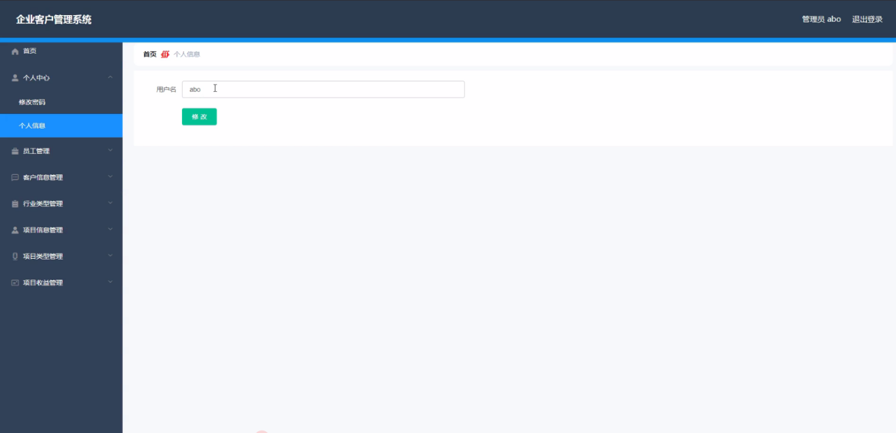
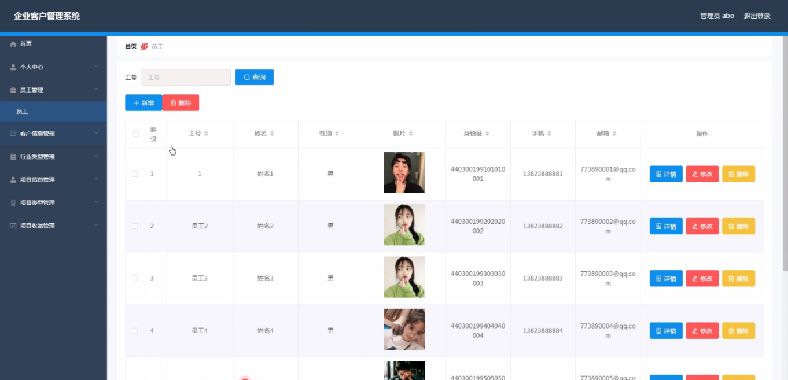
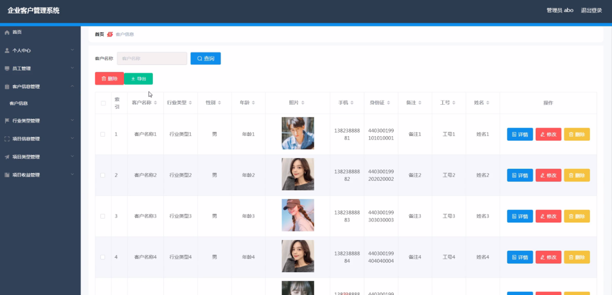
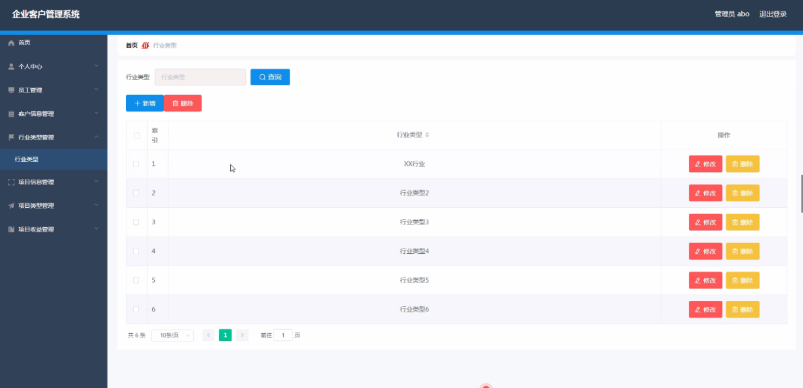
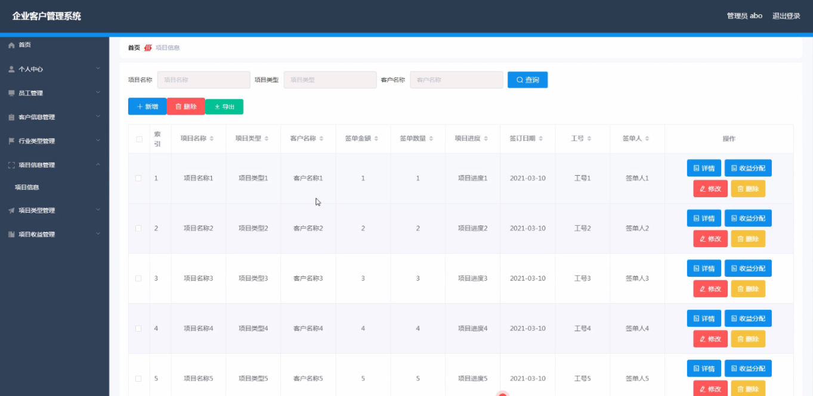
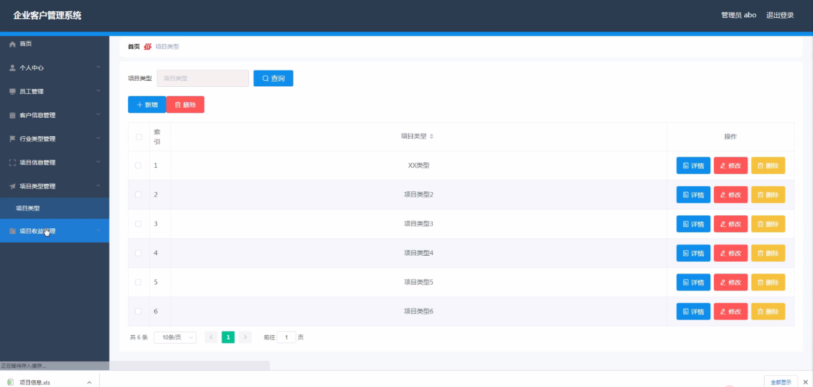
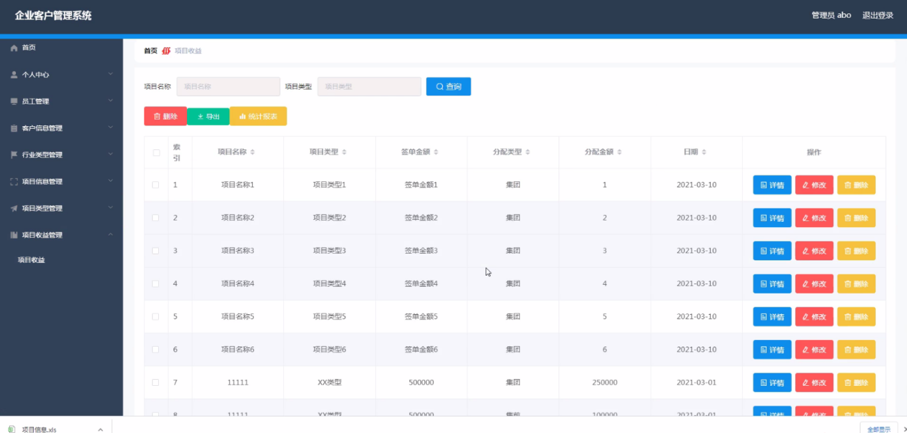
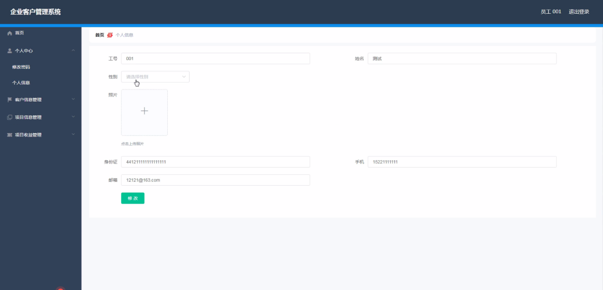
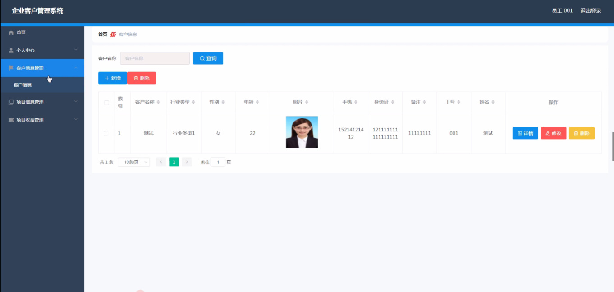
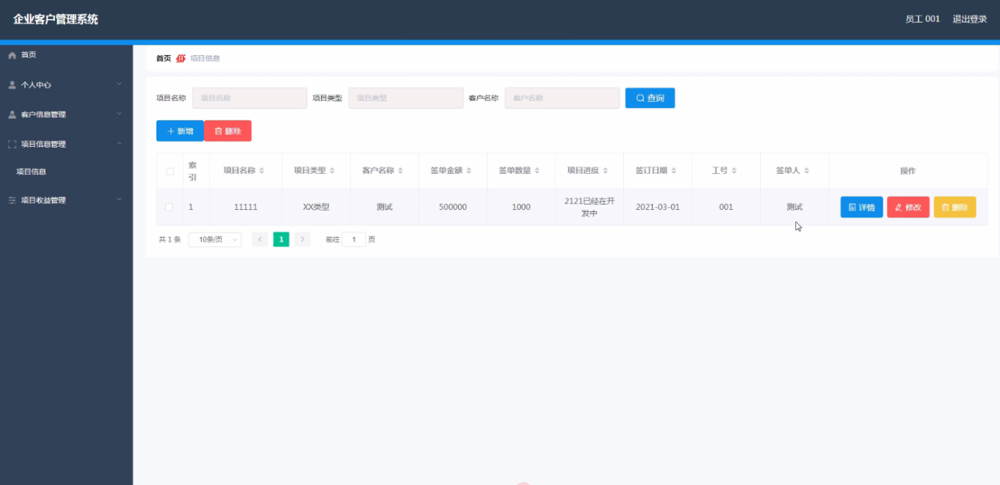

**项目简介：**  
本项目基于主流的前后端分离架构，采用 **SpringBoot + Vue 技术栈**，配套 **MySQL 数据库**，适用于毕业设计与课题实训开发。  
本人已整理了超 **4000 多套毕业设计源码+论文+开题报告+PPT...**，涵盖 **Java、SpringBoot、Vue、SSM、uni-app 小程序、PHP、Android** 等方向，支持功能修改定制与论文服务。  
**团队提供以下服务：**  
- 项目代码修改与调试  
- 数据库配置与远程协助  
- 论文定制与修改  
**获取更多的4000多套源码或SQL文件请联系：**  
- QQ：3906443360 微信：BesheHelp

## springboot024基于SpringBoot的企业客户管理系统的设计与实现

**项目简介：**  
本项目基于主流的前后端分离架构，采用 **SpringBoot + Vue 技术栈**，配套 **MySQL 数据库**，适用于毕业设计与课题实训开发。  
本人已整理了超 **4000 多套毕业设计源码+论文+开题报告+PPT...**，涵盖 **Java、SpringBoot、Vue、SSM、uni-app 小程序、PHP、Android** 等方向，支持功能修改定制与论文服务。  
**团队提供以下服务：**  
- 项目代码修改与调试  
- 数据库配置与远程协助  
- 论文定制与修改  
**获取更多的4000多套源码或SQL文件请联系：**  
- QQ：3906443360 微信：BesheHelp**

# 系统实现与系统测试

# 第5章 系统详细设计

5.1管理员功能模块

管理员登录，通过填写用户名、密码、角色进行登录，如图5-1所示。

图5-1管理员登录界面图

管理员登录进入企业客户管理系统可以查看首页、个人中心、员工管理、客户信息管理、行业类型管理、项目信息管理、项目类型管理、项目收益管理等信息。

个人信息，在个人信息页面中可以通过填写用户名等内容进行修改、添加操作，如图5-2所示。在员工管理页面中可以填写工号、姓名、性别、照片、身份证、手机、邮箱等信息，还可以根据需要对员工管理进行详情、修改或删除等操作，如图5-3所示。

图5-2个人信息界面图

图5-3员工管理界面图

客户信息管理，在客户信息管理页面中可以填写客户名称、行业类型、性别、年龄、照片、手机、身份证、备注、工号、姓名等信息，并可根据需要对已有客户信息管理进行详情、修改或删除等操作，如图5-4所示。

图5-4客户信息管理界面图

行业类型管理，在行业类型管理页面中可以填写行业类型等内容，并可根据需要对已有行业类型管理进行修改或删除等操作，如图5-5所示。

图5-5行业类型管理界面图

项目信息管理，在项目信息管理页面中可以填写项目名称、项目类型、客户名称、签单金额、签单数量、项目进度、签订日期、工号、签单人等内容，并且根据需要对已有项目信息管理进行详情、收益分配、修改或删除等操作，如图5-6所示。

图5-6项目信息管理界面图

项目类型管理，在项目类型管理页面中可以填写项目类型等内容，并且根据需要对已有项目类型管理进行详情、修改或删除等操作，如图5-7所示。

图5-7项目类型管理界面图

项目收益管理，在项目收益管理页面中可以填写项目名称、项目类型、签单金额、分配类型、分配金额、日期等内容，并且根据需要对已有项目收益管理进行详情、修改或删除等操作，如图5-8所示。

图5-8项目收益管理界面图

5.2员工功能模块

员工登录进入企业客户管理系统可以查看首页、个人中心、客户信息管理、项目信息管理、项目收益管理等内容。

员工注册，员工注册通过填写输入工号、姓名、性别、照片、身份证、手机、邮箱等信息即可进行员工注册，如图5-9所示。

图5-9员工注册界面图

个人信息，在个人信息页面中可以查看工号、姓名、性别、照片、身份证、手机、邮箱等信息内容，并且根据需要对已有个人信息进行修改等其他详细操作，如图5-10所示。

图5-10个人信息界面图

客户信息管理，在客户信息管理页面中通过填写客户名称、行业类型、性别、年龄、照片、手机、身份证、备注、工号、姓名等信息内容，并且根据需要对已有客户信息管理进行详情、修改、删除等其他详细操作，如图5-11所示。

图5-11客户信息管理界面图

项目信息管理，在项目信息管理页面中可以填写项目名称、项目类型、客户名称、签单金额、签单数量、项目进度、签订日期、工号、签单人等信息内容，并且根据需要对已有项目信息管理进行详情、修改、删除等详细操作，如图5-12所示。

图5-12项目信息管理界面图

